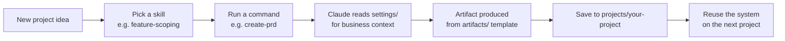

# AI-PM-OS

**A reusable product management operating system for working with Claude and GitHub.**

Built by [Mani Grewal](https://productmanagementwithmani.substack.com) · For product managers who want a repeatable system, not another one-off prompt.

---

## The problem this solves

Most PMs use AI like a search engine: ask a question, get an answer, copy it somewhere, forget it happened. A month later the prompts are gone, the decisions are undocumented, the research is scattered across chat windows, and every new project starts from a blank page.

AI-PM-OS is the alternative: a single repository that holds your skills, templates, prompts, and business context, so every project you start inherits a working system instead of starting from zero.

You do not need to know how to code. If you can create folders and upload files, you can run this.

## What's inside

| Folder | What it holds |
|---|---|
| [`skills/`](skills/) | Reusable PM knowledge Claude can apply on demand — scoping, discovery, prioritization, roadmapping, metrics, experimentation, stakeholder management, AI evaluation. |
| [`artifacts/`](artifacts/) | Fill-in templates this system produces — PRDs, evaluation plans, experiment briefs, decision logs, launch checklists, roadmaps, and diagrams. |
| [`commands/`](commands/) | Prompts you reuse instead of rewriting every week — create a PRD, write a user story, evaluate a feature, generate a roadmap, write an exec summary, analyze feedback. |
| [`mcp/`](mcp/) | Onboarding docs for the external systems you connect — GitHub, Jira, Notion, Figma, Slack. |
| [`settings/`](settings/) | The business context that makes AI output specific to you — glossary, personas, business context, product principles. |
| [`projects/`](projects/) | One folder per real project, each inheriting everything above. |
| [`CLAUDE.md`](CLAUDE.md) | Standing instructions for how Claude should work with you in this repo. |
| [`.github/copilot-instructions.md`](.github/copilot-instructions.md) | The same consistency, applied to GitHub Copilot. |

## How it works

## Quick start

1. Clone or download this repository.
2. Open Claude (or Claude Code) and attach the repo, or paste the relevant files into a chat.
3. Pick a skill from `skills/` that matches what you're doing.
4. Run the matching command from `commands/` with your real feature context.
5. Review the output, edit it, and save the finished artifact into `projects/your-project/`.
6. Reuse the same skill and command the next time you need it.

### Example prompt

> Use the `feature-scoping` skill and the `PRD-template` to create an MVP scope for a LinkedIn Saved Posts redesign.

## Why a repository, and not a doc

A folder of Google Docs doesn't version, doesn't diff, and doesn't travel with you between tools. A repository does. Every skill, template, and decision here is plain text, which means:

- Claude and Copilot can both read it directly.
- Every change has history — you can see what a PRD looked like before a pivot.
- It's portable. Fork it, copy it into a new project, hand it to a teammate.

## License

See [LICENSE](LICENSE).
